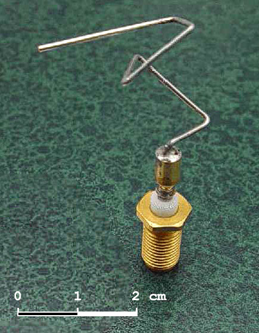

<samp>

> The 2006 NASA ST5 spacecraft antenna. This complicated shape was found by an evolutionary computer design program 
> to create the best radiation pattern. It is known as an evolved antenna[^1].

### Codebase overview
Algorithms references for educational and prototyping solutions to combinatorial optimization problems based on 
**Genetic Algorithms**.

### Intro
In computer science and operations research, a genetic algorithm (GA) is a metaheuristic inspired by the process 
of natural selection. Some examples of GA applications include optimizing decision trees for better performance, 
solving sudoku puzzles, hyperparameter optimization, etc.

### GA steps
1. **Initialization**: Generate a population of random solutions. The population size typically contains several 
hundreds or thousands of possible solutions. Often, the initial population is generated randomly but occasionally, 
the solutions may be "seeded" in areas where optimal solutions are likely to be found.
2. **Evaluation**: Evaluate the fitness of each solution in the population. The fitness function is typically
a measure of how well the solution meets the problem's objectives.
3. **Selection**: Select a subset of the population to be used as parents for the next generation. The selection
process is typically based on the fitness of the solutions. The fitness function and selection process is usually 
defined by the problem domain and is not part of the GA algorithm.
4. **Crossover**: Create new solutions by combining the solutions selected in the previous step. The new solutions
are added to the population.
5. **Mutation**: Apply random changes to some of the solutions in the population. The purpose of mutation is to
prevent the population from converging to a local optimum.
6. **Termination**: If a termination criterion is not met, repeat from step 2.

### Settings
It is worth tuning parameters such as the mutation probability, crossover probability and population size to find 
reasonable settings for the problem class being worked on. A very small mutation rate may lead to genetic drift. 
A recombination rate that is too high may lead to premature convergence of the genetic algorithm. A mutation rate that 
is too high may lead to loss of good solutions, unless elitist selection is employed. An adequate population size 
ensures sufficient genetic diversity for the problem at hand, but can lead to a waste of computational resources if set 
to a value larger than required[^2].

#### Notes
[^1]: [Evolved Antenna](https://en.wikipedia.org/wiki/Evolved_antenna)
[^2]: [Wikipedia: Genetic Algorithms](https://en.wikipedia.org/wiki/Genetic_algorithm)

</samp>
